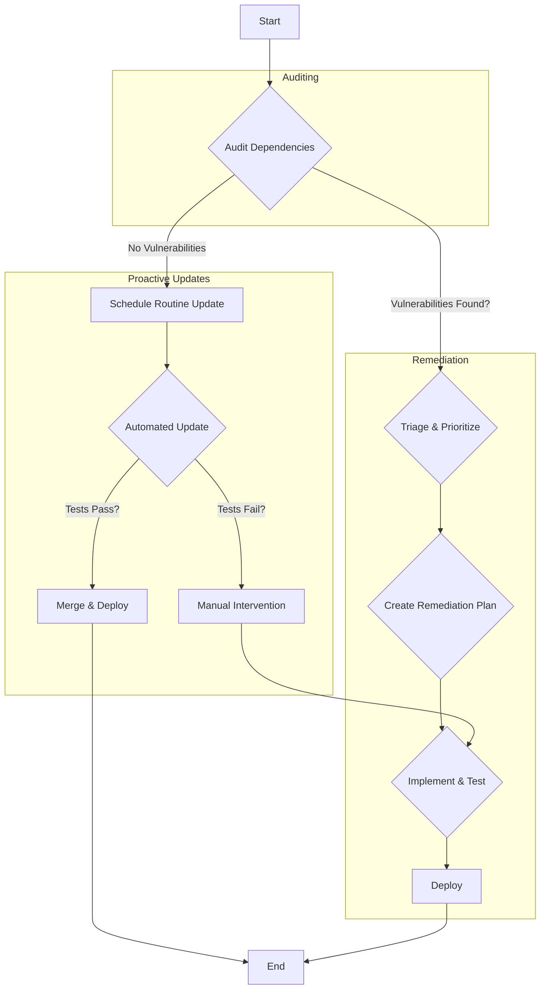

# Dependency Management Process

This document outlines the formal process for managing dependencies in the AI Room Cleaner application. The goal is to maintain a secure and up-to-date codebase by regularly auditing and updating dependencies, minimizing security risks, and ensuring long-term project stability.

## 1. Dependency Auditing

Regular auditing of dependencies is critical for identifying and mitigating security vulnerabilities.

### Frontend (JavaScript)

*   **Tool**: `npm audit`
*   **Process**:
    1.  **Scheduled Audits**: An automated audit will run weekly via a CI/CD pipeline job.
    2.  **Manual Audits**: Developers should run `npm audit` before committing any changes to `package.json` or `package-lock.json`.
    3.  **Reporting**: High and critical severity vulnerabilities will automatically create a ticket in the project's issue tracker.

### Backend (Python)

*   **Tool**: `pip-audit`
*   **Process**:
    1.  **Scheduled Audits**: An automated audit will run weekly via a CI/CD pipeline job.
    2.  **Manual Audits**: Developers should run `pip-audit` before committing any changes to `pyproject.toml` or `poetry.lock`.
    3.  **Reporting**: High and critical severity vulnerabilities will automatically create a ticket in the project's issue tracker.

## 2. Update Strategy

A clear and consistent update strategy ensures that dependencies are kept current without introducing breaking changes.

*   **Patch Updates (e.g., 1.0.x -> 1.0.y)**: These are for backward-compatible bug fixes and should be applied automatically by our dependency management tool as soon as they are available, provided all tests pass.
*   **Minor Updates (e.g., 1.x.x -> 1.y.0)**: These add functionality in a backward-compatible manner. They will be bundled into a single weekly update to be reviewed and tested by the development team.
*   **Major Updates (e.g., x.x.x -> y.0.0)**: These contain breaking changes and require manual intervention. An issue will be created to assess the impact, plan the migration, and allocate development time. Major updates should not be applied without a thorough review and testing plan.

## 3. Automated Tooling

To streamline the dependency update process, we will use **Dependabot**.

*   **Configuration**: Dependabot will be configured in the project's GitHub repository.
*   **Functionality**:
    *   It will automatically create pull requests (PRs) for out-of-date dependencies.
    *   For patch and minor updates, it will attempt to merge the PR if the CI/CD pipeline (including tests) passes.
    *   For major updates, it will create a PR but will not merge it automatically. This PR will serve as a notification for the team to begin the manual update process.

## 4. Implementation Plan

The following steps will be taken to implement this dependency management process:

1.  **Configure Automated Auditing (1-2 days)**:
    *   Add a new job to the CI/CD pipeline that runs `npm audit` for the frontend and `pip-audit` for the backend.
    *   Configure the job to run weekly and on every pull request that modifies dependency files.
2.  **Integrate Dependabot (1 day)**:
    *   Enable Dependabot in the GitHub repository.
    *   Configure Dependabot to follow the update strategy outlined in section 2.
3.  **Documentation & Training (1 day)**:
    *   Add this `DEPENDENCY_MANAGEMENT.md` file to the repository.
    *   Hold a brief training session with the development team to review the new process.
4.  **Initial Dependency Update (3-5 days)**:
    *   Perform an initial audit and update of all dependencies to establish a secure baseline.